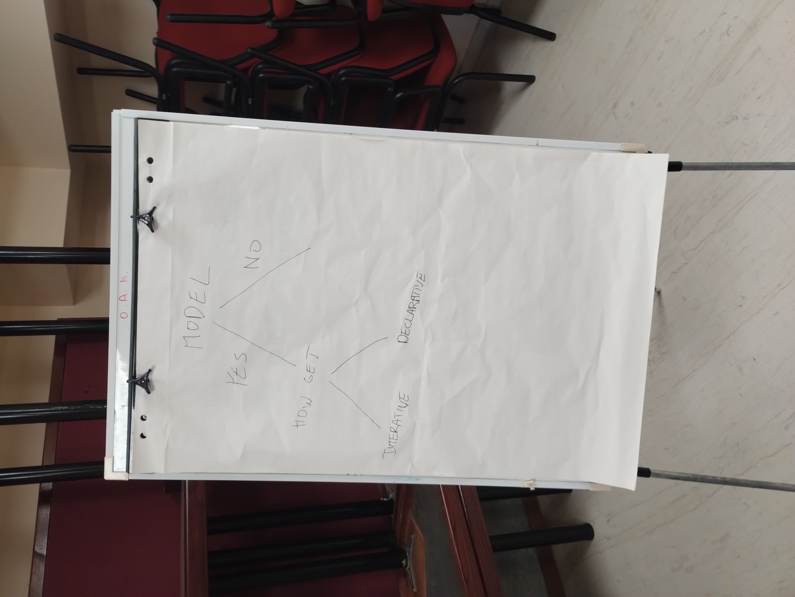

Declarative vs. Imperative Builds
---------------------------------

First, the overall way builds may work were discussed (see [1]). Build tools may:

1. have no project model, and be fully imperative/procedural. Older examples
   include [Apache Ant](https://ant.apache.org), newer include
   [Bach](https://github.com/sormuras/bach) and [just](https://github.com/casey/just).
2. have a project model, and this model is filled using imperative/procedural code.
   An example may be [Gradle](https://gradle.org/).
3. have a project model, and this model is filled using declarative or mostly
   declarative means. An example is [Apache Maven](https://maven.apache.org)

There is a significant difference between build tools using the approaches set above,
both for other tooling, like IDEs, and for the developers.

For build tools in the first category, it is not possible to determine the meaning
of the project without running or simulating all the build tasks, and the meaning
of the build can change from run to run. This complicates the support of these
for IDEs, and it is very hard to autoconfigure from scripts like this. As the build
scripts can have any form, and perform any tasks, it may be also difficult for
the users to understand the build function.

For build tools in the second category, it is still necessary to execute parts of
the build script to understand the project structure, but the actual build tasks
don't need to be executed, it is usually enough to execute code that builds
the internal model.

For build tools in the third category, the project structure can be partially or
completely undestood without running the build scripts.

Running the build script code has the obvious security implications - when
the project is checked out out of a remote repository, the user must trust
the code before running it.

After this, the dicussion turned to a discussion on dependencies.
Current trees of transitive dependencies may be big and complex.
Some participants have seen that as a possibly unfortunate, but inevitable,
consequence of code sharing. Others have seen that as problematic, and were
more inclined to use "leaf" dependencies (dependencies without transitive
dependencies). Another option discussed where flattened dependencies, where
the project uses only direct dependencies, and consequently all transitive
dependencies must be manually resolved and added to the list of project's dependencies.

[1] 
