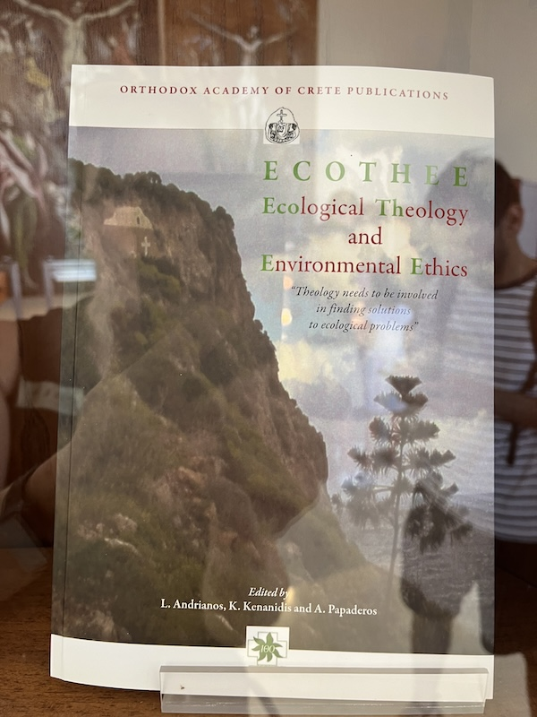
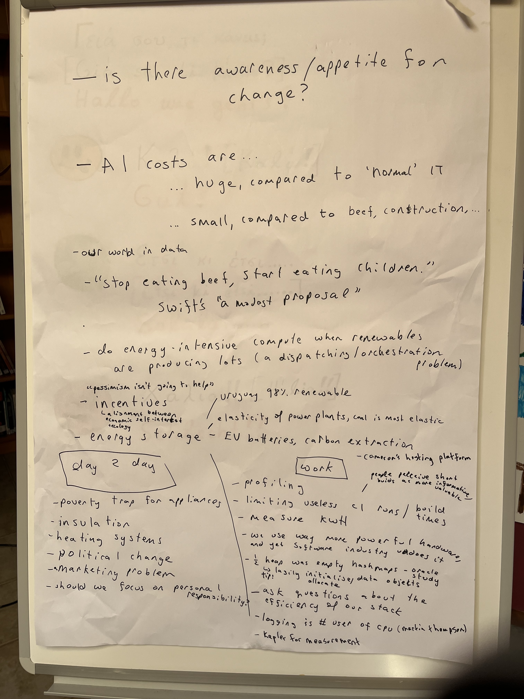

I saw this in the display cases by lunch, and it seemed appropriate to our discussion. 

## Useful links

- [Our World in Data](https://ourworldindata.org/co2-and-greenhouse-gas-emissions). Hannah Ritchie maintains an excellent set of data about drivers and solutions to climate change.
- ["The Week" videos and program](https://www.theweek.ooo/). Yorgos found it was a great way to raise awareness with friends&family.
- ["These Five Tricks Can Make Your Java Apps Cleaner, Greener, and Nicer"](https://www.youtube.com/watch?v=eCQKYStnqW8). A talk of Holly's on some of the technical aspects of reducing IT emissions. 
- [Kepler](https://www.cncf.io/projects/kepler/). Energy monitoring for Kubernetes and Linux applications.
- [How Uruguay has 98% renewable energy](https://www.theguardian.com/global-development/2023/dec/27/uruguays-green-power-revolution-rapid-shift-to-wind-shows-the-world-how-its-done)

## Session notes

Here are the notes from the session:

